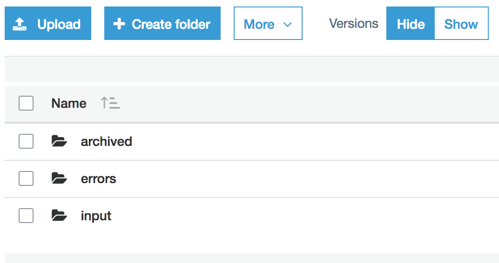

# RandomPythonNotebooks
A place to save random python notebooks

<ul>
<li> <b>AWS S3 file manipulations</b> shows a few simple manipulations of files in an AWS S3 bucket
<li> <b>Decision tree path</b> for each path of a decision tree, extracts the decisions at each node
<li> <b>Text Classification Using TF-IDF vectorization</b> classify BBC news articles into 5 categories (business, entertainment, politics, sport, tech)
</ul>

A brief description of each notebook follows.

<h3>AWS S3 file manipulations</h3>

The purpose of this notebook is to illustrate how to move files in S3 buckets, by copying and deleting files using the boto3 python library.

The example I will use consists of an S3 bucket that has three folders: <b>input</b>, <b>archived</b> and <b>errors</b>. 

  
 

Initially, the <b>archived</b> and <b>errors</b> folders are empty, whereas the <b>input</b> folder has a single file in it: *IF009_1.txt*  

<h3>Decision Tree Path</h3>
Train a decision tree on a data set. Then extract the decision tree paths. For each path, obtain the decisions for each node as well as some summary statistics of each leaf.

