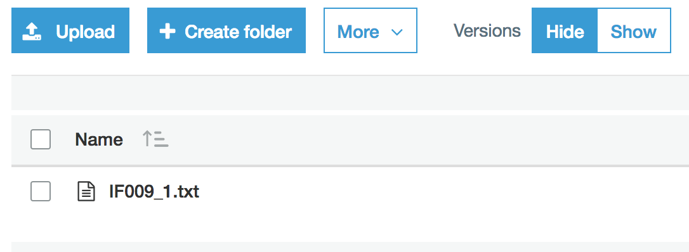

# RandomPythonNotebooks
A place to save random python notebooks

<ul>
<li> <b>AWS S3 file manipulations</b> shows a few simple manipulations of files in an AWS S3 bucket
</ul>

<h3>AWS S3 file manipulations</h3>

The purpose of this notebook is to illustrate how to move files in S3 buckets, by copying and deleting files using the boto3 python library.

The example I will use consists of an S3 bucket that has three folders: <b>input</b>, <b>archived</b> and <b>errors</b>. 

  
 

Initially, the <b>archived</b> and <b>errors</b> folders are empty, whereas the <b>input</b> folder has a single file in it: *IF009_1.txt*  

